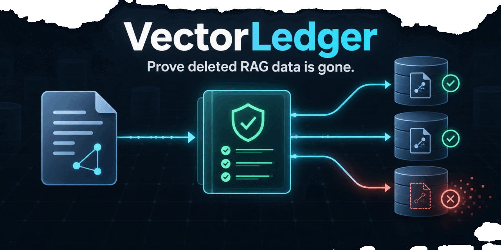
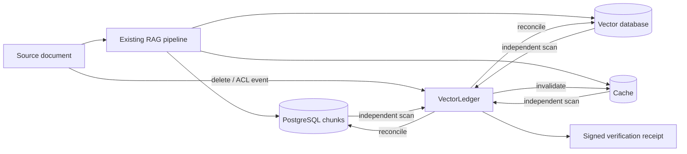
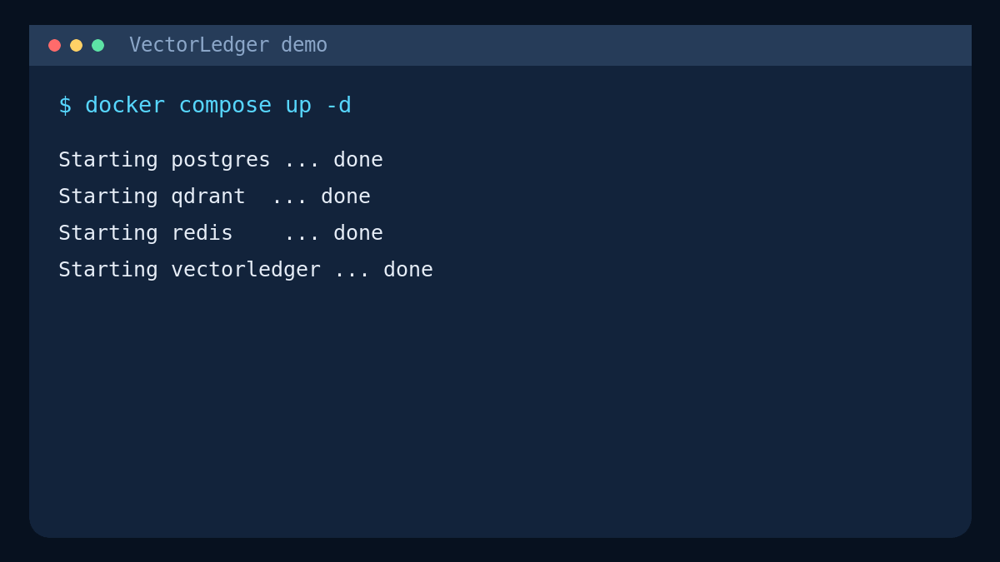

# VectorLedger

[](https://github.com/mrhello291/VectorLedger/actions/workflows/ci.yml)
[](LICENSE)
[](https://github.com/mrhello291/VectorLedger/pkgs/container/vectorledger)



**Prove that deleted or restricted RAG data is no longer retrievable.**

VectorLedger is a self-hosted consistency controller for retrieval-augmented generation systems. It receives document lifecycle changes, reconciles derived data across stores, independently scans for stale records, and emits tamper-evident verification receipts.

It does not replace an ingestion pipeline. It supervises the copies that pipeline creates.



## What works in this MVP

- Immutable document identity plus monotonic versions
- Idempotent deletion and permission propagation
- Metadata-based discovery of artifacts that were never registered
- PostgreSQL ledger and append-only signed receipts
- Connectors for PostgreSQL chunk tables, Qdrant, and Redis
- Periodic anti-entropy reconciliation
- Tenant-scoped HTTP API and optional API-key authentication
- CLI, Docker Compose demonstration, unit tests, API tests, linting, and CI

## Five-minute demo



Requirements: Docker with Compose.

```bash
docker compose up --build -d
docker compose --profile demo run --rm demo
```

The demo deliberately writes data directly into PostgreSQL, Qdrant, and Redis without registering artifact locations. It then registers only the source document and requests deletion. VectorLedger discovers the derived records through `tenant_id` and `document_id`, deletes them, scans again, and returns a signed receipt.

Open the API documentation at [http://localhost:8080/docs](http://localhost:8080/docs).

Clean up:

```bash
docker compose down -v
```

## Core workflow

Every derived record should carry stable lineage metadata:

```json
{
  "tenant_id": "acme",
  "document_id": "salary-policy",
  "document_version": 7
}
```

Register a source document:

```bash
curl -X POST http://localhost:8080/v1/documents \
  -H 'Content-Type: application/json' \
  -H 'X-Tenant-ID: acme' \
  -d '{
    "document_id": "salary-policy",
    "version": 1,
    "source_uri": "s3://acme/salary-policy.pdf",
    "allowed_principals": ["group:hr"]
  }'
```

Artifact registration is optional but recommended because it strengthens lineage and auditability:

```bash
curl -X POST http://localhost:8080/v1/documents/salary-policy/artifacts \
  -H 'Content-Type: application/json' \
  -H 'X-Tenant-ID: acme' \
  -d '{
    "artifact_id": "qdrant:rag_chunks:123",
    "document_version": 1,
    "target": "qdrant",
    "locator": {"collection": "rag_chunks", "point_id": 123}
  }'
```

Delete and verify:

```bash
vectorledger delete salary-policy --tenant acme
vectorledger verify salary-policy --tenant acme
```

Example result:

```json
{
  "document_id": "salary-policy",
  "desired_state": "deleted",
  "status": "verified",
  "targets": [
    {"target": "postgres", "clean": true, "remaining_count": 0},
    {"target": "qdrant", "clean": true, "remaining_count": 0},
    {"target": "redis", "clean": true, "remaining_count": 0}
  ],
  "signature": "..."
}
```

## Running locally

Python 3.11+ is required.

```bash
python -m venv .venv
source .venv/bin/activate
pip install -e '.[dev]'
cp .env.example .env
vectorledger serve
```

Or run the published container:

```bash
docker pull ghcr.io/mrhello291/vectorledger:0.1.0
```

Run quality checks:

```bash
make test
make lint
```

## Configuration

| Variable | Purpose | Default |
|---|---|---|
| `VL_DATABASE_URL` | PostgreSQL control-plane ledger | local PostgreSQL URL |
| `VL_TARGET_POSTGRES_URL` | Company's RAG chunk database | disabled |
| `VL_TARGET_POSTGRES_TABLE` | Chunk table name | `rag_chunks` |
| `VL_QDRANT_URL` | Qdrant endpoint | disabled |
| `VL_QDRANT_COLLECTION` | Qdrant collection | `rag_chunks` |
| `VL_QDRANT_API_KEY` | Qdrant authentication | disabled |
| `VL_REDIS_URL` | Redis endpoint | disabled |
| `VL_RECEIPT_SECRET` | Receipt HMAC secret | development-only value |
| `VL_API_KEY` | Require `X-API-Key` | disabled |
| `VL_RECONCILE_INTERVAL_SECONDS` | Anti-entropy interval | `60` |

## Safety model

Deletion is safe to retry. A target is reported clean only after a post-operation discovery scan returns no matching records. Connector failures and unavailable registered targets produce a `failed` receipt. VectorLedger does not equate an accepted delete request with verified deletion.

See [architecture](docs/architecture.md), [connector contract](docs/connectors.md), and [security model](SECURITY.md).

## How it differs

| Capability | Ingestion framework | One-off delete script | VectorLedger |
|---|---:|---:|---:|
| Parse, chunk, and embed documents | Yes | No | No |
| Record cross-store lineage | Sometimes | Rarely | Yes |
| Retry partial deletion safely | Pipeline-specific | Usually no | Yes |
| Discover unregistered stale records | Rarely | No | Yes |
| Periodic anti-entropy repair | Rarely | No | Yes |
| Verify actual post-deletion state | Rarely | Usually trusts API success | Yes |
| Produce a signed audit receipt | No | No | Yes |

VectorLedger complements LangChain, LlamaIndex, Haystack, and custom ingestion systems. It does not compete with their parsing or retrieval features.

## Integrations

- [LangChain tracked-ingestion example](examples/langchain/README.md)
- PostgreSQL/pgvector-compatible chunk tables
- Qdrant payload-filter discovery
- Redis cache invalidation

See the [roadmap](ROADMAP.md) for Azure AI Search, Elasticsearch, Milvus, retrieval probes, and KMS-backed receipts.

## Current boundaries

This is an MVP, not a compliance certification. HMAC receipts prove possession of the configured secret, not an independent third-party timestamp. Retrieval-path probes, KMS/asymmetric signatures, source watchers, durable job leases, pagination beyond the first 256 Qdrant points, and more connectors are logical next milestones.

## Contributing

Issues labeled [`good first issue`](https://github.com/mrhello291/VectorLedger/labels/good%20first%20issue) are designed for new contributors. See [CONTRIBUTING.md](CONTRIBUTING.md) and the [Code of Conduct](CODE_OF_CONDUCT.md). Licensed under Apache-2.0.
