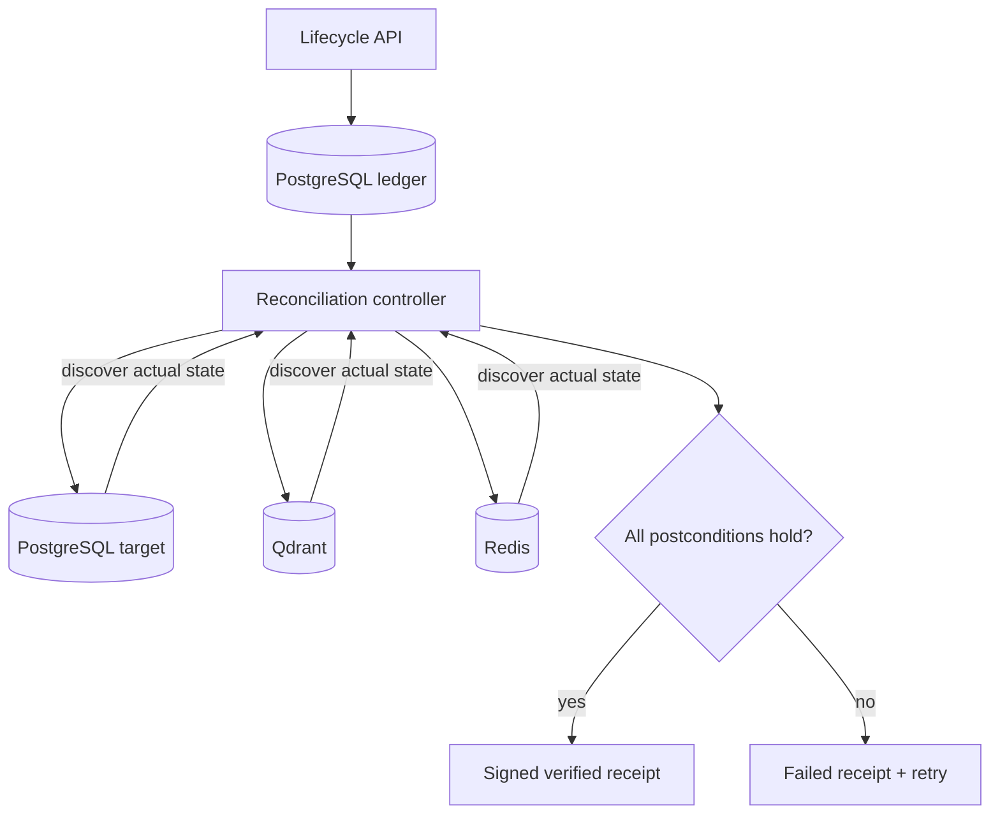

# Architecture

## Desired state and actual state

The document ledger contains the desired state: active with a specific ACL, or deleted. Each connector reports actual records discovered in its target. Reconciliation attempts to make actual state match desired state and then performs a fresh discovery pass.

## Data model

- `vl_documents`: tenant-scoped source identity, version, desired state, source URI, hash, and ACL.
- `vl_artifacts`: optional lineage pointers reported by ingestion systems.
- `vl_receipts`: immutable reconciliation results and signatures.

`(tenant_id, document_id)` is the stable identity. A filename is never used as identity because files can move, be renamed, or collide.

## Reconciliation semantics

1. Serialize reconciliation for one document inside a process.
2. Load the latest desired state and registered lineage.
3. Run independent target operations concurrently.
4. Delete or propagate permissions using tenant and document metadata.
5. Discover target records again.
6. Mark the target clean only when the postcondition holds.
7. Sign and persist the complete result.

All connector mutations must be idempotent. Periodic anti-entropy runs repair transient partial failures.

## Consistency

VectorLedger provides eventual consistency across heterogeneous stores. A receipt describes a point-in-time observation; a later broken ingestion job could recreate stale data, which is why periodic reconciliation remains necessary.

The MVP serializes per-document work only within one API process. A production multi-replica deployment should add PostgreSQL advisory locks or durable job leases.
